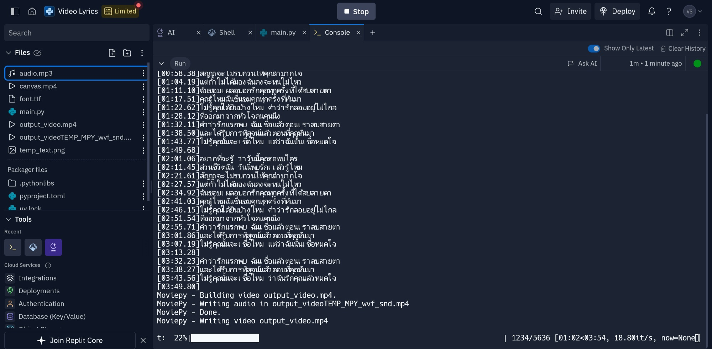
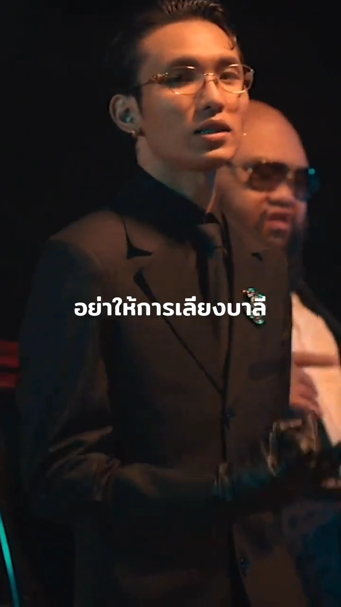

# Lyric Video Generator

### **ภาพรวม**
**"เราใช้[PaxSenix API](https://api.paxsenix.biz.id/docs/)"**

เพื่อดึงเนื้อเพลง Canvasและเพลง โดยใช้TrackIDจากSpotify

---

### **สิ่งที่ต้องเตรียม**
1. ติดตั้ง Python 3.x
2. ติดตั้งไลบรารี Python เหล่านี้:
   - `requests`
   - `moviepy 1.0.3`
   - `Pillow`

3. ติดตั้ง **FFmpeg** และเพิ่มลงใน PATH ของระบบ (จำเป็นสำหรับ `moviepy`)

#### คำสั่งติดตั้งไลบรารี
```bash
pip install requests
```
```bash
pip install moviepy==1.0.3
```
```bash
pip install Pillow
```

---

### **วิธีการใช้งาน**
1. **แก้ไข `track_id`**  
   เปลี่ยนค่า `track_id` ในสคริปต์เป็น Spotify Track ID ที่ต้องการ เช่น:
   ```python
   track_id = "ใส่Track ID"
   ```

2. **รันสคริปต์**  
   ใช้คำสั่ง:
   ```bash
   python autolyrics.py
   ```
   

3. **ผลลัพธ์**  
   สคริปต์จะสร้างวิดีโอเนื้อเพลงชื่อ `output_video.mp4` ในไดเรกทอรีปัจจุบัน
   
   
